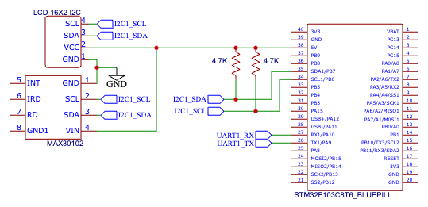

MAX30102_STM32FW
================

Target: STM32F103C8Tx

Raw Data -> Heart Rate 알고리즘은 SparkFun Electronics의 MAX3010x 아두이노 라이브러리의 알고리즘 사용

센서를 통해 얻은 데이터는 UART로 출력

가장 마지막 BPM과 평균 (최근 32개) BPM은 1602 LCD로 출력 (1초에 한번 씩 갱신)

## Diagram
